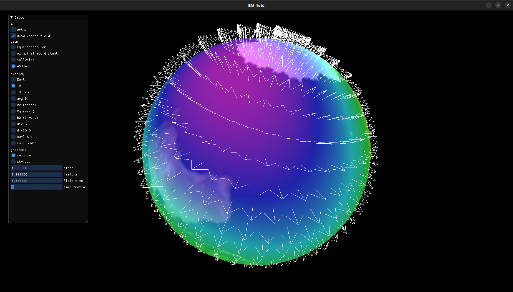

 

## Visualization of the WMM 2020 data.

If you need more data:

https://geographiclib.sourceforge.io/html/magnetic.html

from https://ngdc.noaa.gov/geomag/faqgeom.shtml:

- B X = north field component
- B Y = east field component
- B Z = down field component

units are in nT

Done so far:
- B field calcs are in GLSL
- so are coordinate charts
- so are chart basis
- This means the surface B-field arrows are all drawn on GPU with instance geometry.
- The B-field surface arrows can animate with adjusting the time
- The heatmap overlay of various display methods can animate with adjusting the time.
	- However its normalization is only calculated for the current time, so gradients might spill over.
- The magnetic field lines are calculated/integrated once via CPU and are stuck in place.

TODO:
- Update B stats when the dt slider changes.
- Regenerate magnetic field lines when the dt slider changes.
	- Everyone knows how to do realtime 2D isobars on the GPU.  There's some stuff on 3D surfaces on GPU.  But what about realtime field line calculations on GPU?
